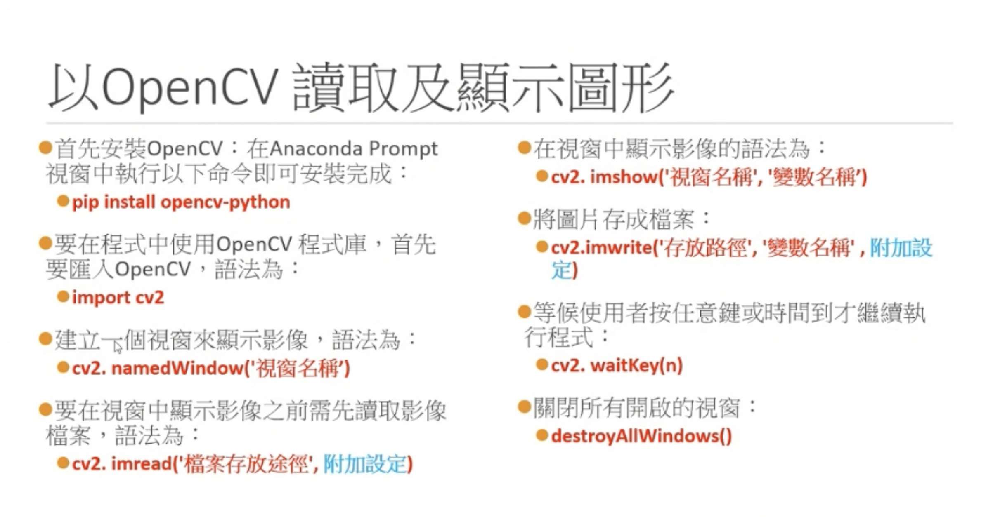
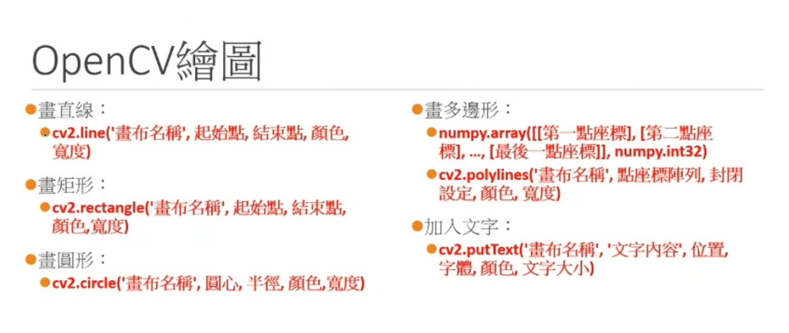
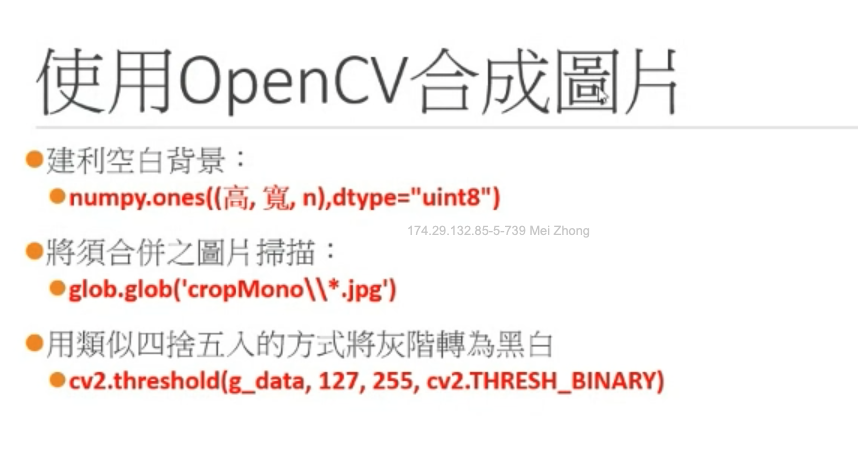

# OpenCV

## Open an image

- Slide
  
- Example code

  ```py
      import cv2

  # build a window named 'testImage'
  cv2.namedWindow('testImage')
  # Read image
  img = cv2.imread('MJ.png')
  # display image
  cv2.imshow('testImage', img)

  # wait for user to press key. 0 means at fastest speed to receive input.
  cv2.waitKey(0)
  # close the window
  cv2.destroyAllWindows()
  ```

## Convert image to gray

- Example code

  ```py
    import cv2

    cv2.namedWindow('testImage')
    cv2.namedWindow('testImage_G')
    img = cv2.imread('MJ.png')
    img_G = cv2.imread('MJ.png', cv2.IMREAD_GRAYSCALE)
    cv2.imshow('testImage', img)
    cv2.imshow('testImage_G', img_G)

    cv2.imwrite('MJ_G.jpg', img_G)
    cv2.imwrite('MJ_G_low.jpg', img_G, [int(cv2.IMWRITE_JPEG_QUALITY),50])

    cv2.waitKey(0)
    cv2.destroyAllWindows()
  ```

## OpenCV draw

- Slide
  
- Example Code

  ```py
  import cv2
  import numpy

  # OpenCV 的顏色配置不是 RGB，是 BGR
  # 所以(255,0,0)不是紅色，是藍色
  # 如果解析度 1024*768，那麼代表有786,432個點
  # X座標是 0~1023，Y座標是 0~767
  # X座標增加，則點會往右移動。Y座標增加，則點會往下面移動。

  img = cv2.imread("MJ.png")

  # 畫一條從(50,50)到(200,50)的直線，顏色是紅色(0,0,255)，寬度是3
  cv2.line(img, (50,50), (200,50), (0,0,255), 3)

  # 畫矩形的時候，需要給與對角線的起點以及終點
  # 換句話說，也就是矩形的左上與右下兩個點, 也就是对角线的两个点。
  #cv2.line(img, (50,75), (200,100), (0,0,255), 3)， 空心
  cv2.rectangle(img, (50,75), (100,100), (0,0,255), 3)
  # 如果邊的寬度填入的是負數，就代表是實心多邊形， 实心
  cv2.rectangle(img, (125,75), (200,100), (0,0,255), -1)

  # 畫圓形，要給的是圓心、半徑
  cv2.circle(img, (75,150), 25, (255,0,0), 3)
  cv2.circle(img, (150,150), 25, (255,0,0), -1)

  # 畫多邊形，需要先建立頂點陣列
  # 頂點陣列可以用 numpy 建立 array
  # 在polylines函數中，使用多邊形陣列的時候，要用 [ ] 把參數包起來
  # 因為polylines的函數有封邊設定，因此考量到使用者可能選擇不封邊，因此這隻函數不支援著色
  # False: 不封闭多边形。 True：封闭多边形。
  points1 = numpy.array([[300,200], [350,300], [300,300]], numpy.int32)
  cv2.polylines(img, [points1], False, (150,150,150), 3)
  points2 = numpy.array([[350,200], [400,300], [350,300]], numpy.int32)
  cv2.polylines(img, [points2], True, (150,150,150), 3)
  # 如果硬要封邊的多邊形，可以用另外一隻函數 fillPoly
  points3 = numpy.array([[250,200], [300,300], [250,300]], numpy.int32)
  cv2.fillPoly(img, [points3], (150,150,150))

  # OpenCV 裡面放文字的位置，會是文字顯示框的 "左下角"
  # 之所以這樣設定，是為了方便搭配模型做辨識時用以搭配範圍框來顯示文字
  # OpenCV 不接受中文顯示
  cv2.rectangle(img, (300,75), (400,100), (0,0,255), 1)
  # Parameters: 1.画布名称，2.文字内容，3.位置，4.字体，5.颜色，6.文字大小                                           字體                  文字大小      筆畫粗細
  cv2.putText(img, "Test text!", (300,75), cv2.FONT_HERSHEY_SIMPLEX, 0.5, (0,0,0), 1)

  cv2.namedWindow("test")
  cv2.imshow("test", img)

  cv2.waitKey(0)
  cv2.destroyAllWindows()
  ```

## Merge drawings

- slide

  

- Example code

  ```py
  import cv2, glob
  import numpy

  #利用glob套件掃描固定資料夾中有那些副檔名是jpg的檔案
  # MAC
  file_list = glob.glob("numbers/*.jpg")
  # Windows PC
  # file_list = glob.glob("numbers\\*.jpg")
  #可以知道資料夾裡面有幾張圖
  file_num=len(file_list)
  print(file_list, file_num)

  #把其中一張圖讀取進Python，並且計算寬&高
  file_1 = cv2.imread(file_list[0])
  file_h =file_1.shape[0]
  file_w =file_1.shape[1]

  #利用前面算出來的寬與高的資訊，建立一張符合大小的背景畫布
  canvas = numpy.ones((file_h,file_w*file_num), dtype = "uint8")
  #把背景顏色設定成白色
  canvas[:] = 255

  #enumerate與一般迴圈不同的地方，在於它會同時回傳index
  for index, file in enumerate(file_list):
      #將檔案一個個讀入Python
      # 0：Gray　Scale 灰色, 1：RGB scale 彩色
      m_data = cv2.imread(file,0)
      #按照檔案內容，把數值複製到背景畫布中
      for row in range(file_h):
          for col in range(file_w):
              #為了避免圖片疊再一起，所以按照index往右邊平移
              canvas[row][col+file_w*index]=m_data[row][col]

  cv2.namedWindow("Canvas")
  cv2.imshow("Canvas", canvas)
  cv2.imwrite("numbers\\merge.jpg", canvas)

  cv2.waitKey(0)
  cv2.destroyAllWindows()
  ```
