# NLP 自然语言处理

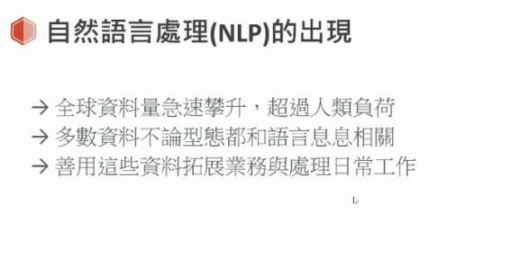
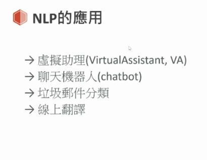
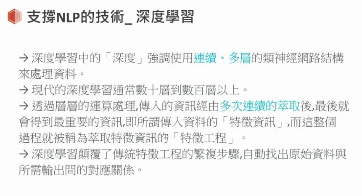
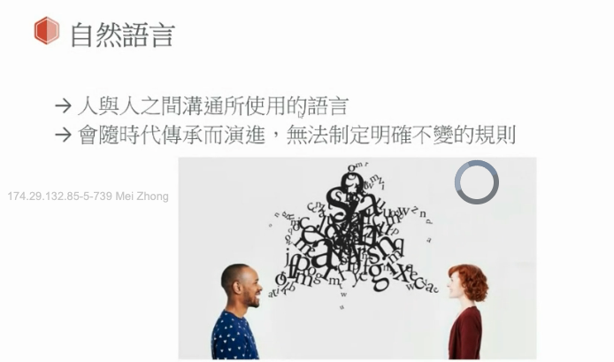

- 自然语言是人沟通使用的语言
- 程式语言比自然语言简单
  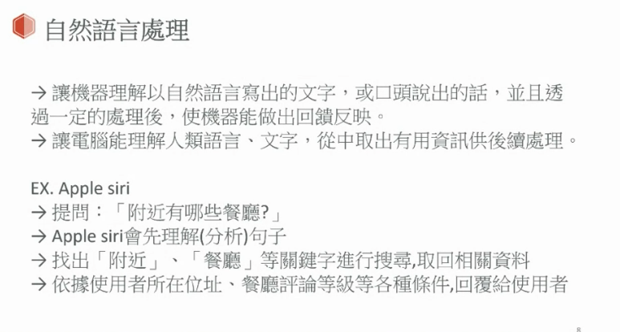

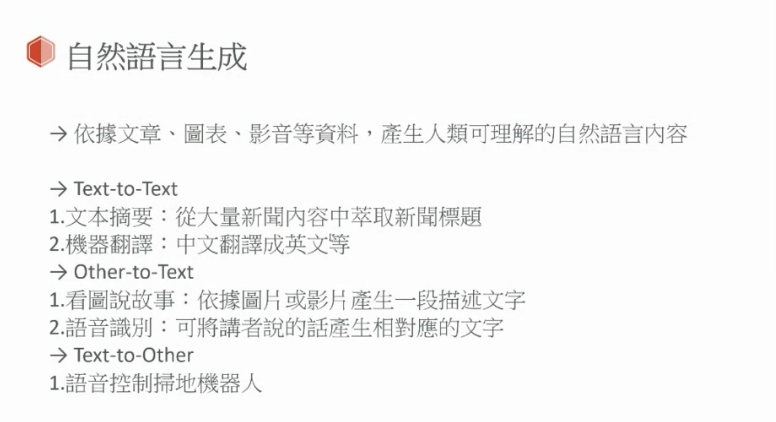

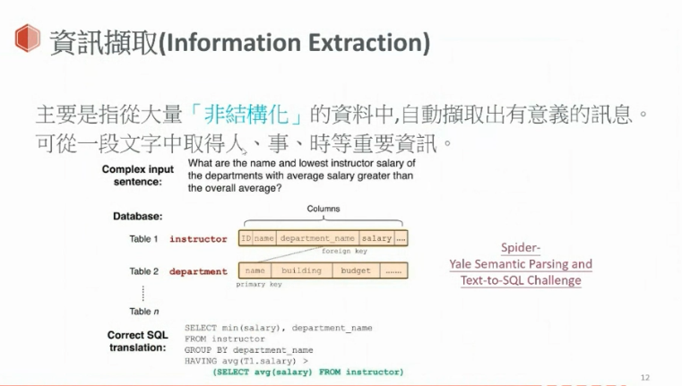
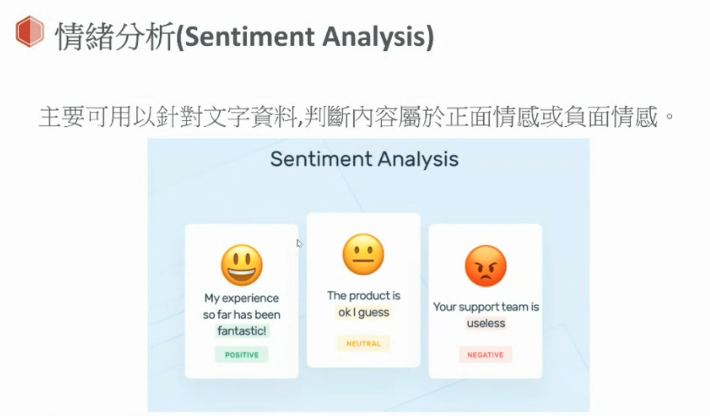
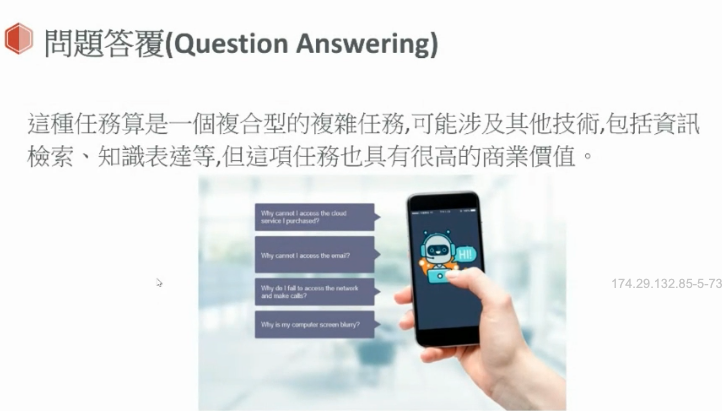
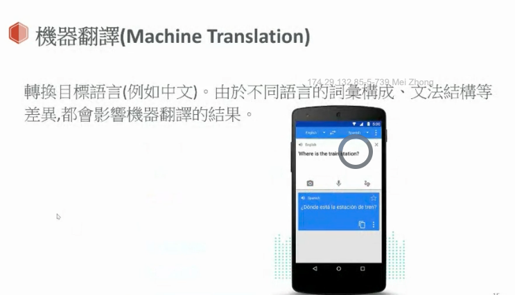
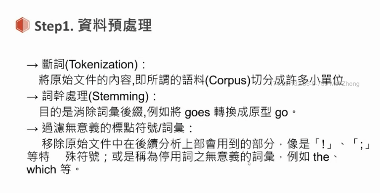
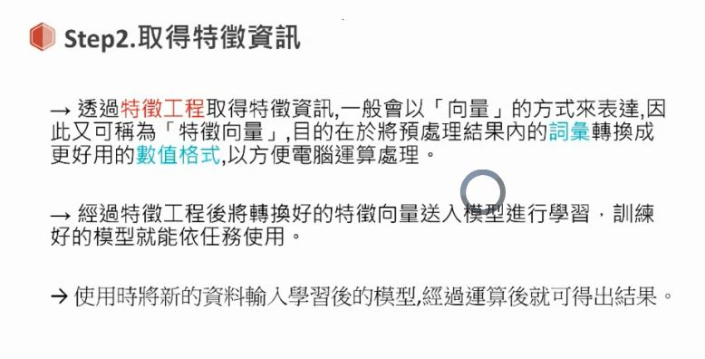
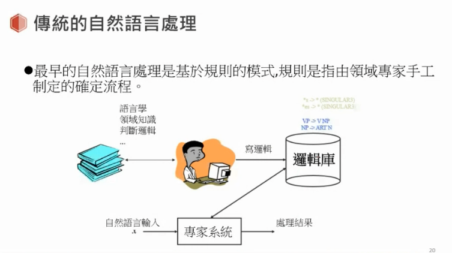
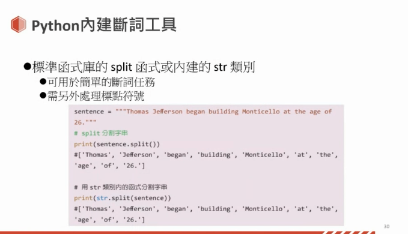
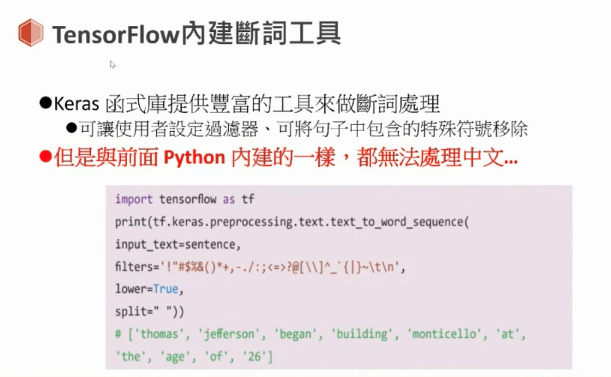

## 词向量

### One-hot 表示法

- 优点：简单
- 稀疏矩阵问题 - 矩阵非常大， 有资料的位置很少
  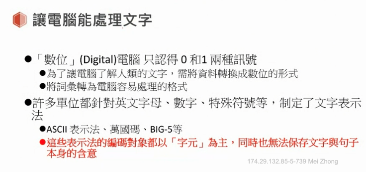

### Word2Vec 表示法

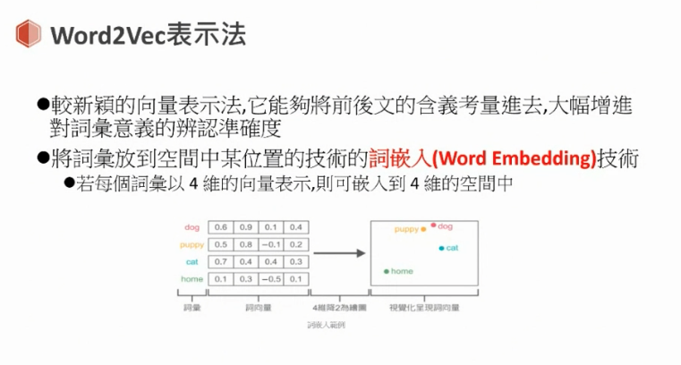
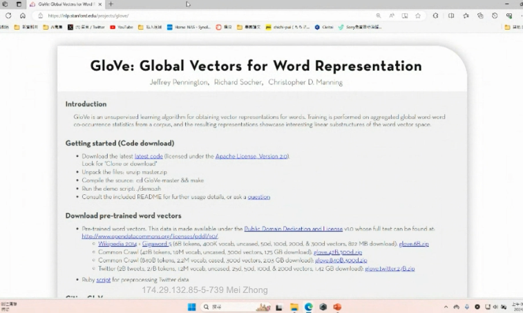
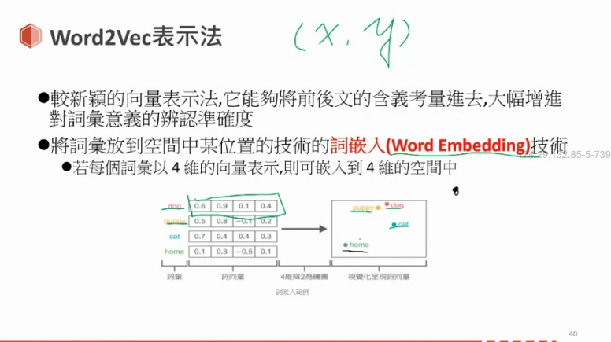

- 词向量的数学运算
  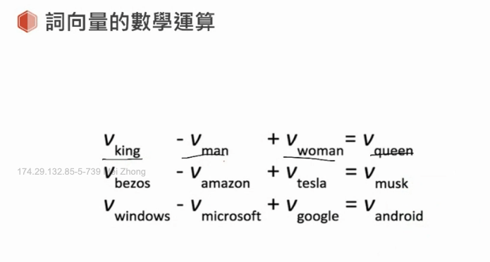

- 自然语言处理中最常见，最基本的向量表示方法
  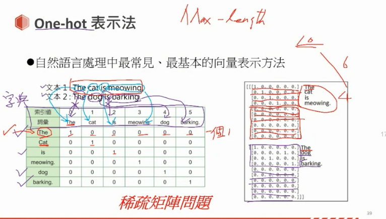
- 词向量空间
  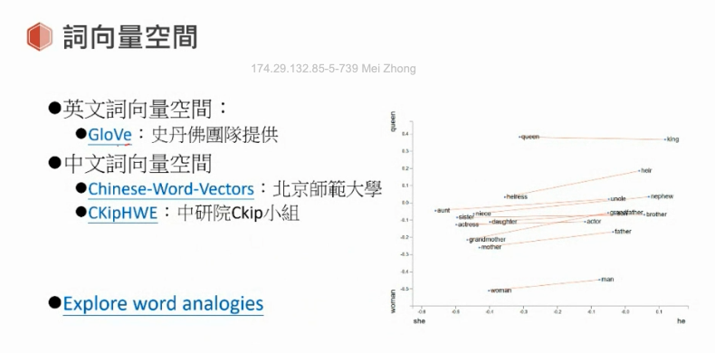
  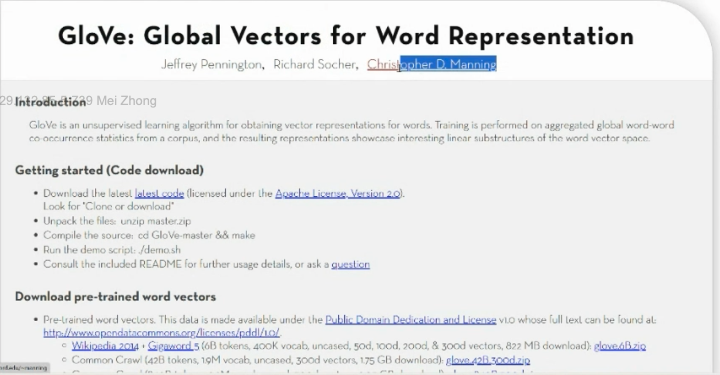

- 神经网络

  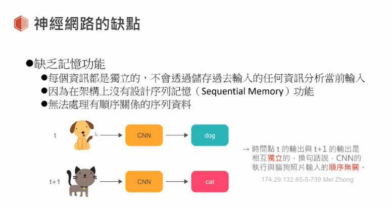
  
  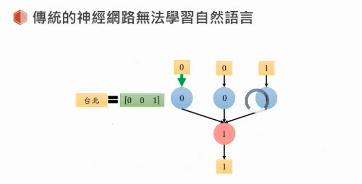
  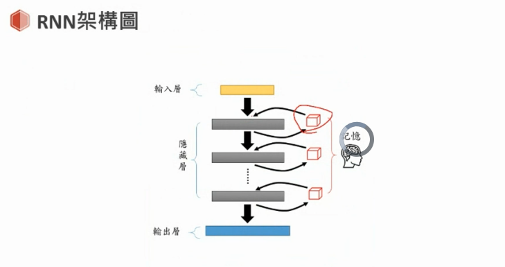
  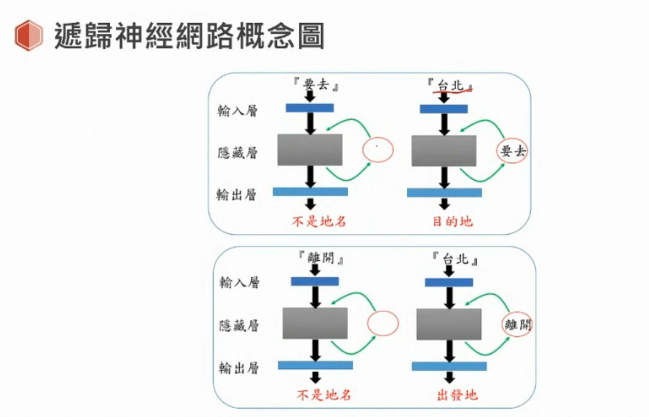
  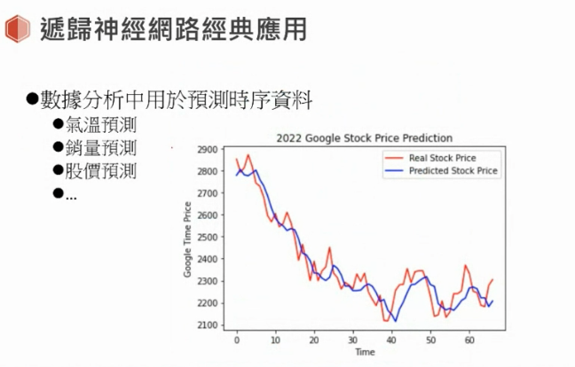
  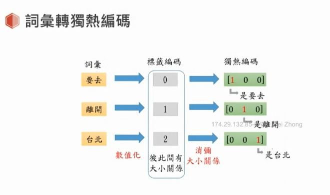
  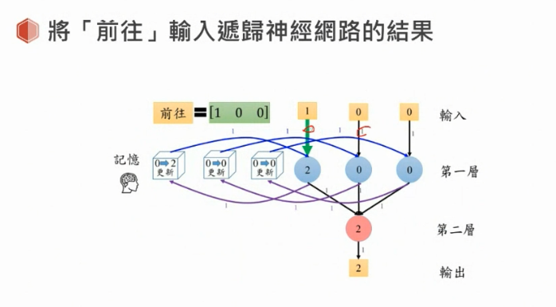
  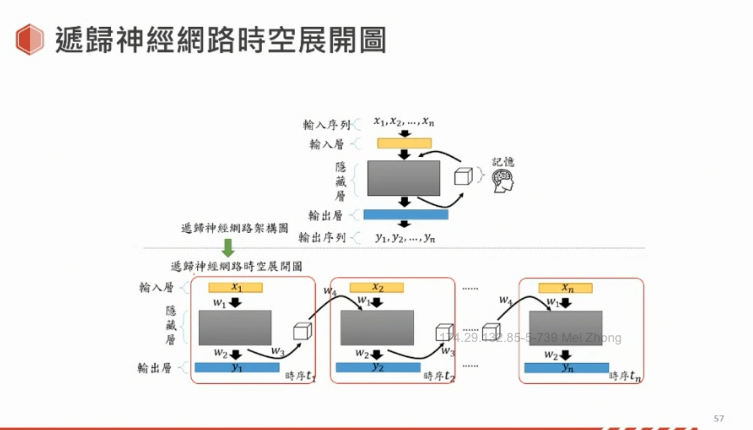

  - RNN 不能做并行处理
    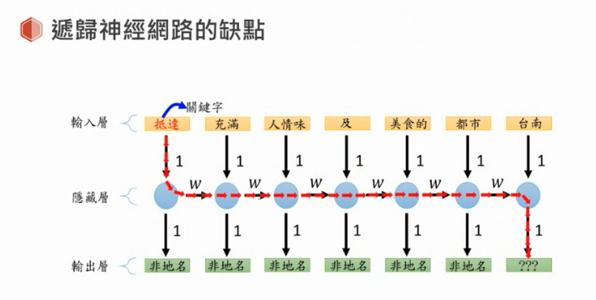

### 中文断词工具

- Jieba
  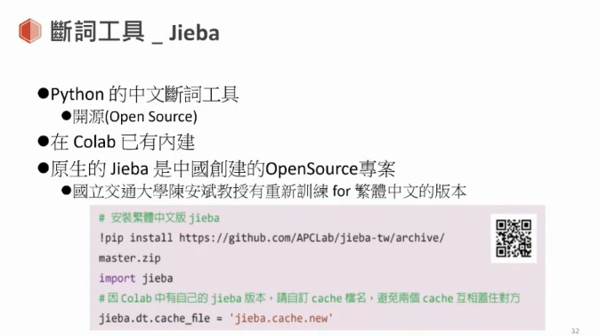
- CkipTagger
  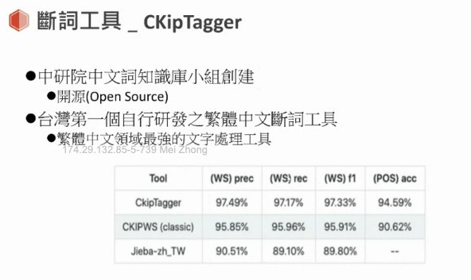
